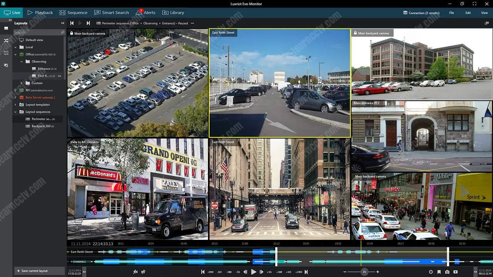
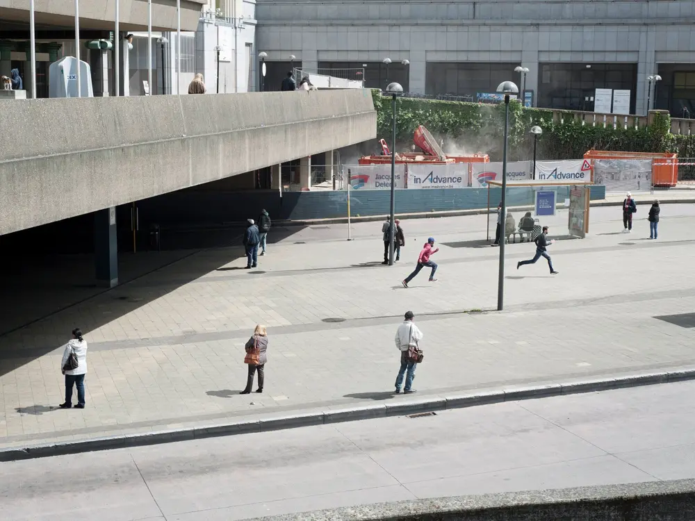

# Davo's Portfolio
*This is part of [Davo's resume](https://cdn.snart.me/hireme/). This is a living
document. Revision: 0*

Dear human readers,

In this era of ATS and AI, I cannot thank you enough for taking your valuable
time to have a look at my portfolio. Here, I present you my best efforts to
showcase my work experience in simple terms for both non-technical and technical
audience. I hope you enjoy.

(c) 2025 David Timber

## Keywords
C/C++ dev, sysadmin, network engineering

Linux, OpenWrt, Qt, MSVC++, MFC, WinAPI, ffmpeg, OpenCV, OpenGL, DirectX, WebGL

Embedded development, kernel development, React, ReactNative, Unity

WebRTC, real-time streaming/processing, web development, frontend, backend

AWS, GCP, Azure, Orchestration, Ansible, Docker, CD/CI(Github, Gitlab), libvirt

## Language Skills
| Expert | Good/average | Good/average but rather not use it |
| - | - | - |
| C, Python, Shell | C++, PHP, Basic, CSS, SQL | Javascript, Java |

## Danusys
In Korea, video surveillance is a multi-million dollar industry. Danusys has had
a fair share of the market since 2007 a contractor for multiple municipal
government across South Korea.

### System architecture
https://www.datapanik.org/wp-content/uploads/CCTV-Cameras-by-City-and-Country.pdf

A usual metropolitan city council operates 10k+ fixed camera sites. Over the
dark fibre network, the video streams are relayed to the city council data
centre, where the video streams are stored and monitored by the operators.

A massive amount of data has to be transferred, processed, stored in real-time.
Numerous contractors are involved to build the infrastructure required. Multiple
technologies, including ones home-brewed by Danusys, are employed to overcome
many engineering challenge to build such systems.

Simplified diagram of Danusys VMS architecture

*(This is a typical architecture of any VMS solution. The actual product names
are replaced with generic tech industry jargons to avoid breach of NDA.)*

#### Edge Node
The video streams from multiple cameras are gathered on the edge node. A
specialty hardware is used where the cameras are traditional analogue cameras to
transcode the footage to modern encodings like H264 and HEVC. The video streams
are encapsulated in one unified internal protocol for ease of processing,
transport, and storage. The edge node is responsible for (but not limited to):

- Relaying streams to the data centre
- Processing footage and decision making in real-time
  - Track moving objects using [PTZ camera](https://en.wikipedia.org/wiki/Pan%E2%80%93tilt%E2%80%93zoom_camera)
  - Alerting the command centre and sounding alarms in case of events
  - Facial recognition and [ANPR](https://en.wikipedia.org/wiki/Automatic_number-plate_recognition) (where required)
- Storing video

Due to RTT(round-trip time), "edge computing"(a technique that's been
popularised recently) is employed. The edge nodes are often equipped with
sufficient computing power to processing video in real-time. The edge nodes
operate autonomously(without the need to communicate to the data centre) to
issue commands to the PTZ cameras and other peripheral devices. The edge nodes
are also capable of storing video on site so that no data is lost during link
failure.

#### Stream Relay Agent
The data link between the camera sites and the local government's data centre is
often limited and unstable. To prevent network overload, real-time streams are
relayed to the data centre where they're duplicated for other purposes such as
storage, further analysis, and manual monitoring by human operators.

The Stream Relay Agent also features conversion from and to standard streaming
format(RTP/RTSP) and vendor-specific proprietary streaming protocols.

#### Stream Store Agent
To implement the [3-2-1 rule](https://www.seagate.com/gb/en/blog/what-is-a-3-2-1-backup-strategy/),
a backend program that stores data relayed from the stream relay agent runs on
the servers at the data centre. The servers are backed by enterprise data
storage(SAN, directly attached SCSI HDDs). The agents are responsible for
storing data for the duration required by local legislation(30 days in Korea)
and deletion of data.

The operators can use the front apps to access data stored on the store agents
to search and view stored videos and events.

#### Master Control Plane Server
The master control plane server is a program that supervises overall operation.
The operation includes:

- Access control: user authentication and authorization
- Distribution of centralised configurations to all backend and frontend nodes
- Enforcing site-specific policies
- Other stateful functionality: scheduled tasks, pre-programmed logic and
  behaviour set by site operators

As the server is a crucial component of the system, the server is hosted on
hardware with additional redundancies. The server also features active-backup
failover.

#### Front GUI Apps

Multiple front-end apps are developed for client's use cases. The apps can be
categorised in these feature groups:

- Control Plane Manager: talks directly to the master control plane server, used
  to configure site-wide settings
- Operator Software: used by command center operators and other external
  stakeholders, including police dept., defense agents, city maintenance
  contractors
  - Viewer for live and stored stream
  - Search engine for stored data
- Diagnostics tools for experts and devs

### My Involvement
Building such a complex software architecture requires a team effort. The
following highlights my involvement and achievement during my time with Danusys.

#### Edge Node
- General maintenance
- Complete rewrite of the existing vision algorithm (detailed in later section)
- Other performance improvements in video decoding, memory management

#### Server Products
- Porting existing Windows server products to Linux
- Linux tech support
- Embedded Linux dev

#### Codec Research
(detailed in later section)

#### Network and Systems Administration
- HQ office net admin, sysadmin
- Site net admin support

---

### Computer Vision R&D
<!-- TODO: hide in printed form -->

- **Project duration**: 1.5 years
- **Written in**: C++
- **Platforms**: Windows, Unix-like

The following diagram illustrates the pipeline of the computer vision algorithm
module for object detection and tracking I myself, under the supervision senior
devs, developed from scratch.

Live video streams are decoded on the edge node and fed to the pipeline for
analysis. The estimated background image constantly gets updated by input
frames. The generated background image is then diff'd against the latest frame
to extract foreground objects. The object association model then takes the
extracted foreground object as input to associate them with the objects appeared
in the previous frames to make the best model of the object's characteristics
including travel path, direction, speed, and type of object.

The information is then consumed by other modules to perform various tasks,
including, but not limited to:

- PTZ tracking
- Preset events e.g. intrusion, loitering
- AI models, facial/plate recognition

<!-- https://www.nytimes.com/2018/08/13/lens/surveillance-camera-photography.html -->

The module is an amalgamation of several algorithms from various papers
optimised for real-time performance and memory footprint. The module is still in
use county-wide.

### Media Codec Research

- **Project duration**: 6 months
- **Written in**: C++
- **Platforms**: Windows, Linux

Media codecs are one of the critical components of the VMS solutions. New
encoding standards are release every decade whilst numerous old cameras are
stuck with legacy video encoding. Some camera vendors insist on supporting their
own proprietary video encoding only to circumvent patent and
[licence fee](https://en.wikipedia.org/wiki/MPEG_LA) issues.

It's not unusual for a VMS solutions to support more than 20+ different video
and audio encodings. This calls for a good codec abstraction layers to keep the
software maintainability at bay.

I was tasked to bring the codec abstraction and APIs up to the modern standard.

#### Hardware accelerated codec

Another engineering challenge for the front apps is the large number of
real-time video streams to decode simultaneously. Mid 2010 was when Intel, AMD
and Nvidia started to embed ASIC video codec in the silicon die. Historically,
the VMS apps had to rely soley on software-based decoding. Modern CPUs and GPUs
are now capable of decoding 2-3 1080p streams at the same time. By utilising all
of the hardware codecs in the CPU and GPU on a regular PC, some of the load
required for video decoding can be offloaded to ASIC decoders. To put things in
perspective, in a 4x4 viewing configuration, 5-6 out of 16 streams could be
offloaded.

Software-based codecs suffer from memory bandwidth starvation since fully
decoded frames need to be transferred back and forth before they can be
displayed:

1. Decoding: encoded 264/HEVC data from memory to full YUV picture to memory
1. Scaling: full YUV picture from memory to scaled down/up RGB picture to memory
1. Rendering: RGB picture from memory to VRAM framebuffer

Some optimisations can help skip the step 2, but there still remains the problem
of having to transfer full 1080p frames 30 times per second through the PCIe
bus. ASIC codecs provide what's called "zero-copy" solution, in which encoded
frames are copied to the VRAM where they are decoded directly to the frame
buffer.

#### SoC codec

There was a brief period when the company endeavoured the venture into the
consumer NVR market in effort of diversifying the B2G portfolio. This meant the
development of a low-cost SoC based NVR.

Many video surveillance companies are faced with the same problem and constantly
try to break free from government funding by venturing into the consumer market.
The major issue is the scale of the domestic market and the fact that the global
market is dominated by cheap Chinese and Taiwanese brands.

Although the product never saw the light of day, my expertise was required for
the development of the product. I added SoC codec support and ported all the
backend daemons and frontend apps.

## Hobbyist years
### Failed video game project
2018

https://youtu.be/PaBgZEkTaFw?si=rI-nD-GpPrW28bEL

### "Proone" Research Linux Worm Virus
2019 - 2022

https://github.com/dxdxdt/proone

### Book: "Dev Log"
Deep dive into network engineering(work in progress).

## Open source project contributions
| project | what | url |
|-|-|-|
| http-server | -H/--header option in line with curl(1) | https://github.com/http-party/http-server/pull/887 |
| NetworkManager | Bug fix: default route pushed RIO(Router Information Option, RFC 4191) in IPv6 RA not honoured | https://gitlab.freedesktop.org/NetworkManager/NetworkManager/-/issues/1666 |
| TP-Link C20-v5 OpenWrt port | OpenWrt port for TP-Link Archer C20 v5, a cheap router found in Australian consumer retail | https://github.com/dxdxdt/tp-link_c20-v5.dev |
