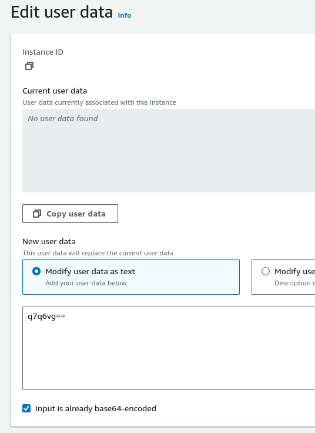
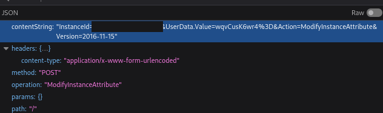

# AWS Management Console cannot handle binary EC2 user data
If "Input is already base64-encoded" option is checked, the browser does not
handle the data as binary and try to convert the input from ISO-8859-1 to utf-8
if it "thinks" it's text data.

## Steps to reproduce
Generate the arbitrary binary. Any binary data should work as long as the JS's
algorithm determines it as text.

```sh
echo -ne '\xab\xba\xba\xbe' | base64
# q7q6vg==
```

Pick a stopped instance to play with. Put the base64 encoded text to the
textbox.



Inspect the actual data uploaded.

```
aws --region=AA-BBBB-N ec2 describe-instance-attribute --instance-id i-NNNNNNNNNNNNNNNNN --attribute userData | jq -r '.UserData.Value' | base64 -d | hexdump -C
```

You'll see that the data is not what you put in.

```
00000000  c2 ab c2 ba c2 ba c2 ba                           |........|
00000008
```

This is a bug in in the web client. It's confirmed by inspecting the actual
request sent to the API endpoint from the browser.



## This can complicate things
According to [the user
guide](https://docs.aws.amazon.com/AWSEC2/latest/UserGuide/instancedata-add-user-data.html),

> User data is treated as opaque data: what you give is what you get back. It is
> up to the instance to interpret it.

User data can be set to binary data using **awscli**. It has no problem handling
binary data and sending it to the API endpoint. The endpoints does not seem to
care about the data. IMDS even returns user data to the instance as
"application/octet-stream" So in essence, you can put anything in your user
data. The AWS Management Console is built upon the assumption that the user data
is always plain text. It always try to decode and show the data as plain text.

> User data must be base64-encoded. The Amazon EC2 console can perform the
> base64-encoding for you or accept base64-encoded input.

This is just because user data has to be put in the request JSON object. Again,
nothing at EC2 end should care about the contents of the user data because it's
an attack vector if anything does.

This complicate things for users who wants to put binary data in user data using
Management Console. Using **awscli** to make launch template is not an easy task
for some people.
