# Dracut에 대해
TITLES:

1. Dracut: 리눅스 커널의 다이어트법

윈도에서 드라이버 설치는 프로그램 설치하는 것 처럼 간단합니다. 리눅스는 모노리딕
커널이다 보니 커널이 구동해야 할 모든 커널이 빌드할 때 있어야 합니다.

리눅스가 지원하는 장치의 종류가 다양하고 지원하는 기능도 많습니다. 그래서 모든
리눅스 코드를 한 이미지로 빌드하면 크기가 큽니다. 리눅스 배포판은 대부분의
컴퓨터에서 동작할 수 있는 커널을 배포해야 하는데, 요즘 컴퓨터에는 다양한 장치가
달려 있습니다: 요즘 PC는 모두 NVME SSD를 사용하고, 좀 오래된 PC는 SATA를
사용하고, 노트북은 와이파이 카드가 달려있는 반면에 PC에는 주로 랜카드가 달려
있는데요. 리눅스 커널은 이 모든 장치들의 코드를 가지고 있어야 합니다.

커널의 모든 기능을 켜 빌드하면 이미지의 크기는 쉽게 100 메가바이트를 넘게
되는데요. 대부분의 컴퓨터는 이 절반도 사용하지 않으므로 100 메가바이트의
메모리가 낭비되게 됩니다.

커널 이미지 크기 문제를 해결하기 위해서 현대 배포판은 드라이버를 모듈로 가지고
있어, PC 구동에 필요한 모듈만 메모리에 로드되는데요. 그러다보니 패키지 매니저로
설치하는 커널 이미지에는 모듈로 빠질 수 없는 가장 핵심적인 코드만 담겨
들어있습니다. 여기서 문제는 부팅에 필요한 드라이버까지 모듈로 빠져있다는
것입니다.

예를 들어, EXT4로 포맷된 루트 파일시스템이 NVME 드라이브에 존재할 수 있습니다.
커널이 로드되고나서 그 파일 시스템을 마운트하려면 그에 맞는 장치 드라이버와 파일
시스템 드라이버가 필요합니다. 파일 시스템이 LVM으로 되어있거나 암호화가
되어있으면 그 드라이버들도 필요할 건데요, 이에 필요한 모듈을 부팅 때 사용하기
위해서 현대 배포판은 "initrd" 혹은 initial ramdisk(초기 램디스크)를 사용합니다.
초기 램디스크는 읽기 전용 루트 파일시스템이며, 실제 루트 파일시스템을 마운트하기
위해 필요한 프로그램과 모듈이 담겨있습니다.

초기 램디스크는 리눅스 커널의 선택적인 기능입니다. 커널 이미지를 만들 때,
이미지가 사용될 시스템의 사양을 알고 있다면 어떤 드라이버를 이미지에 담아야하고
어떤 드라이버를 모듈로 빼야할지 알 수 있습니다. 이런 상황에서는 초기 램디스크
사용이 적합하지 않습니다. 그래서 임베디드 리눅스에는 초기 램디스크가 사용되지
않는데, 그 이유는:

1. 첫째로 초기 램디스크 기능 지원에 필요한 코드의 크기가 큽니다. 킬로바이트
   단위까지 아껴야하는 상황이라면 가장 쉽게 뺄 수 있는 부분이 초기 램디스크 지원
   코드입니다.
1. 두번째로 느립니다: 부트로더가 커널 이미지 뿐만 아니라 초기 램디스크 이미지
   압축을 풀어 메모리에 로드해야 하며, 커널은 필요한 모듈을 이미지에서 꺼내서
   로드해야 하고 사용이 끝난 초기 램디스크 이미지를 언마운트 해야 합니다.

이러한 이유 때문에 임베디드 리눅스에서는 초기 램디스크가 사용되는 것을 보기
힘들겁니다.

초기 램디스크는 크게 두가지 방법으로 생성 가능한데: 모든 커널 모듈을 이미지에
담는 방법이 있고 (이를 현대 배포판은 rescue 이미지라고 부릅니다), "hostonly"
모드라고 해서 해당 PC에 필요한 모듈만 담는 방식이 있습니다. 크기 문제 때문에
배포판은 대부분 후자인 hostonly 모드를 기본적으로 생성하도록 설정되어 있는데요.

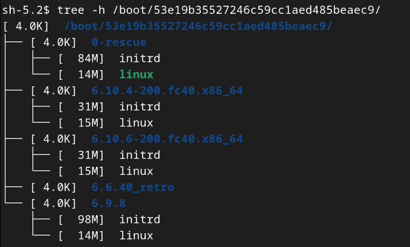

초기 램디스크 사용의 문제는, 리눅스가 설치된 드라이브를 다른 PC로 옮기면 부팅이
되지 않는 문제가 있을 수 있다는 겁니다. 부팅에 필요한 모듈이 다르면 생길 수 있는
문제인데요, 특히나 새로운 PC를 뽑았는데 리눅스는 다시 설치하고 싶지 않다면 생길
수 있는 문제입니다. 이 때는 부팅 시 ESC 키를 계속 눌러 부트로더 메뉴로 진입한
뒤, 커맨드 라인으로 떨어졌다면 `normal` 명령으로 메뉴를 띄우고, rescue 이미지를
사용해 부팅한 뒤 이미지를 재생성하는 방법이 있습니다[^2].

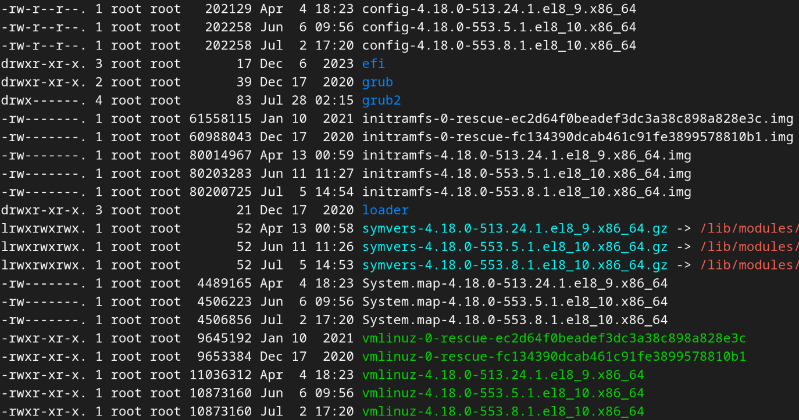

우분투는 `update-initramfs`라는 편의 명령어를 제공합니다. 이 명령으로 최신
커널의 초기 램디스크 이미지를 업데이트할 수 있습니다[^1].

```sh
update-initramfs -u
```

레드헷 기반 배포판은 `dracut`이라는 명령을 제공합니다. 우선 `/boot`에 있는
파일들을 확인해 시스템에 설치된 커널 버전들 확인합니다. 이 디렉터리의 구조는,
배포판에 따라, 일반 혹은 BLS 모델 구조로 되어있습니다. 이 스크린샷을 볼 때, 최신
버전의 커널은 4.18.0-553.8.1.el8_10.x86_64 입니다. 이 커널 버전의 초기 램디스크
이미지를 재생성하려면 명령을 다음과 같이 사용할 수 있습니다.

```sh
dracut -f --kver 4.18.0-553.8.1.el8_10.x86_64
```

## No-hostonly initrd
TITLES:

1. 모든 PC에서 쓸 수 있는 리눅스 USB
1. 윈도 포맷하지 않고 USB에 리눅스 설치하기

전편에서는 `dracut`이 왜 있는지, 그리고 배포판이 `dracut`을 사용해 어떻게 초기
램디스크 이미지 크기를 줄이는지 알아봤습니다.

이 비디오를 보고계시는 시청자께서 리눅스를 처음 접하시는 분이시거, 리눅스를
가상머신이 아닌 PC에서 시용하고 싶으실 수 있으신데요. 라이브 버전의 리눅스를
사용하는 방법이 있지만, 저는 그게 리눅스를 맛볼 수 있는 그리 좋은 방법이
아니라고 봅니다. 그리고 윈도 파티션을 수정하는 등의 작업을 하기 싫으셔서
망설였을 수도 있으실 겁니다.

이번 편에서는 제가 `dracut`을 사용해 어느 PC에서나 사용 가능한 초기 램디스크
이미지를 만드는 방법을 보여드리겠습니다. 이 방법은 과거 마스터 부트 레코드가
사용되던 시절에는 가능하지 않았었는데, 요즘은 펌웨어가 발전해 바이오스로
운영체제를 찾아 선택하는 것이 쉬워졌습니다. 요즘은, EFI를 사용하면, 리눅스
부트로더는 FAT 파티션에 존재하는 단순한 EFI 프로그램이기 때문에 바이오스가
손쉽게 시스템에 설치된 운영체제들을 탐색하는게 간편해 졌습니다.

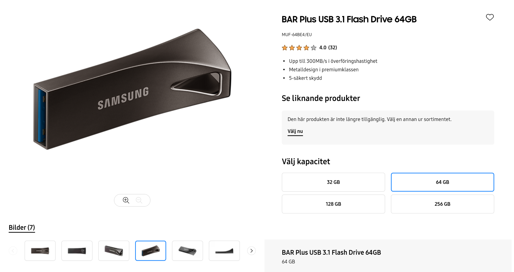

사용할 USB는 쓰기 속도가 괜찮은 제품을 추천해 드리고 싶은데요. 저는 개인적으로
초당 30MB를 지원하는 삼성 바 플러스를 사용했습니다. USB의 쓰기 속도는 여전히
제조사 사이에서 부끄러운 이야깃꺼리로 남아있다보니, 상품 정보에 쓰기 속도가 적힌
USB를 찾기 힘드실 수 있습니다. USB를 선택하시는데 제가 드리고싶은 팁은: USB 3.0
이상이고, 유명한 제조사에서 나왔고, 가격이 싸지 않는 제품일 수록 쓰기 속도가
높을 수 있다는 것입니다. 그렇지만 혹시 모르니 직접 상품 리뷰나 벤치마크 등을
찾아보는 등으로 확실히 집고 넘어가시기를 바랍니다.

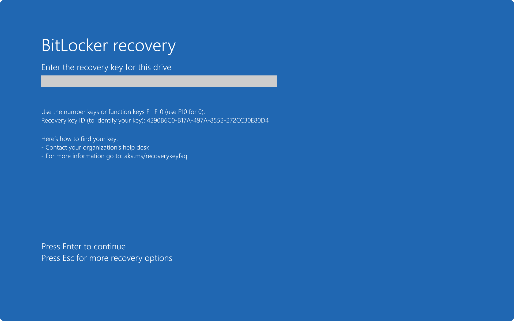

조립 PC를 사용하신다면 비트락커 문제는 크게 걱정하지 않으셔도 됩니다. 하지만
노트북를 사용하시는 분들께 경고드리는데: 윈도 비트락커가 켜져있으면 바이오스에서
부팅 순서를 변경하는 것을 피하셔야 합니다. 비트락커는 바이오스 설정이 조금이라도
변경되면 윈도를 잠궈버려서 그런데요. 이건 제 잘못 아니고, 마이크로소프트를
탓하세요.

비트라커가 켜져있는지의 여부는 "이 PC"에서 확인할 수 있습니다. 윈도 드라이브에
작은 자물쇠 아이콘이 있다면 비트락커가 활성화 되어있다는 뜻입니다.

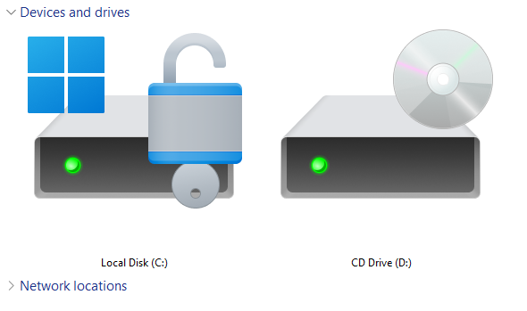
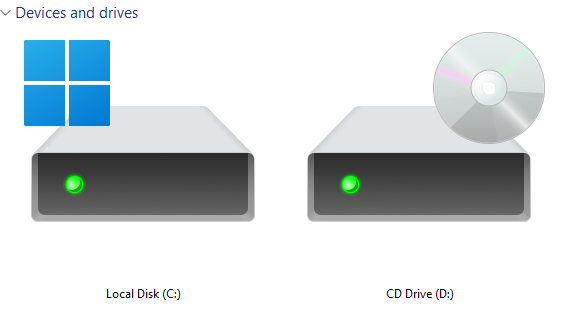

바이오스의 부팅 메뉴를 사용해 바이오스 설정을 건들이지 않고도 USB로 부팅할 수
있습니다. 부팅 메뉴 접근 키는 제조사마다 다 다릅니다: 제품에 따라 F9, F10, F11,
F12, ESC 키, 심지어는 델리트 키 일 수 있는데요. 이건 직접 찾으셔야 합니다.


이제 가상머신을 돌려볼건데요. 저는 버츄얼박스를 사용할 것입니다. VMware
플레이어를 사용하셔도 됩니다. 어떤 가상화 소프트웨어를 사용하는지는 그리 중요하지
않은데, (TODO: show settings)

- VM의 펌웨어를 EFI로 설정할 수 있고,
- USB를 가상머신으로 연결할 수 있기만 하면 됩니다

버츄얼박스를 사용한다면 익스텐션도 설치해서 가상머신에서 USB 3.0을 사용할 수
있게 해야 합니다.

(TODO: play through: installing Ubuntu on a USB using VirtualBox, not attaching
a HDD)

이제 리눅스를 설치했으니, 이 USB를 다른 PC에서도 쓸 수 있게 하기 위해서 초기
램디스크 이미지를 재생성하는 법을 알려드리겠습니다.

복구 이미지를 사용해서 부팅한 뒤 이미지를 재생성할 수 있다보니 굳이 이 작업을
하시지 않아도 되는데요. 크기 때문에 풀 사이즈 이미지를 사용하면 부팅 시간이 약간
늘어나는 불이익이 있지만, 풀 사이즈 이미지를 사용하면 매번 다른 PC에서 사용할
때마다 이미지를 재생성해야 해도 되지 않는 이점이 있기 때문에, 여러 PC에서
돌려가며 USB를 사용하실 계획이라면 이 작업을 하시는 것을 추천합니다.

(TODO: show how to drop to GRUB and boot using the rescue image)

이제 좀 메뉴얼을 읽어봅니다.

```sh
man 8 dracut
```

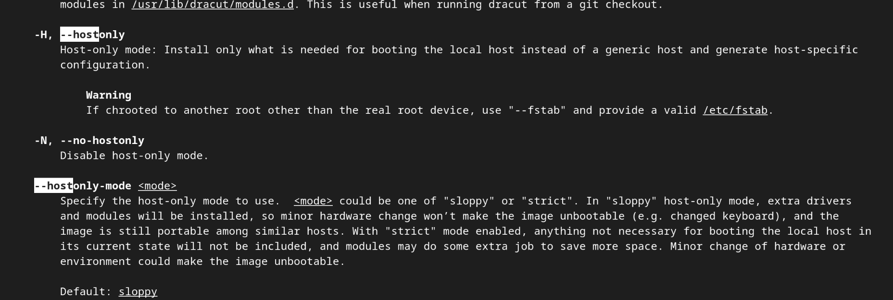


메뉴얼을 보니, 대문자 H 옵션을 사용해서 호스트온리 모드를 킬 수 있고, 대문자
N을 사용해서 이를 끌 수 있다고 되어있습니다. 자, 이제 그건 알겠고, 배포판은
어떻게 해서 이 설정을 바꿀까요?

```sh
man 5 dracut.conf
```


Dracut 명령이 이 파일들에서 설정을 읽는다고 나와있습니다. 그리고 여기 나와았는
것처럼, `hostonly` 설정으로 옵션을 세팅할 수 있다고 나와있습니다.

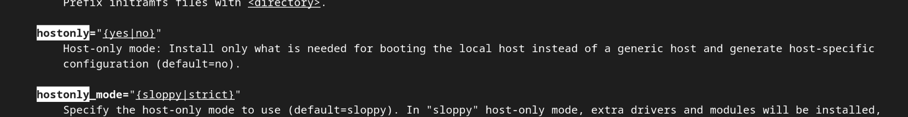

어떤 파일들이 저 경로에 존재하는지 확인해 봅시다.

```sh
ls -l /etc/dracut.conf /etc/dracut.conf.d/*.conf /usr/lib/dracut/dracut.conf.d/*.conf
```

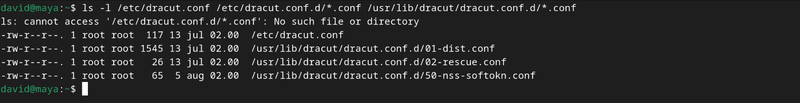

이제, `hostonly` 설정은 어디에 있을까요?

```sh
grep hostonly /etc/dracut.conf /etc/dracut.conf.d/*.conf /usr/lib/dracut/dracut.conf.d/*.conf
```

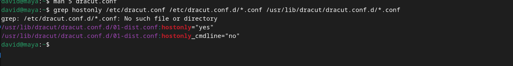

여기 있네요. 파일명이 `01-dist.conf`로 되있는 것을 볼 때, 01보다 큰 이름으로
시작하는 파일을 만들어서 저 파일에 있는 세팅을 덮어쓸 수 있다는 것을 확인할 수
있습니다. `/etc/dracut.conf.d`에 있는 디렉터리에 파일을 생성해서 다른 분이 이
설정을 발견했을 때, 이 설정은 배포판 설정이 아니라 관리자 재량의
커스터마이징이라는 것을 알 수 있게 합니다.

```sh
echo 'hostonly="no"' | sudo tee /etc/dracut.conf.d/90-no-hostonly.conf
```

이제 이 명령이 먹혔는지 확인하고

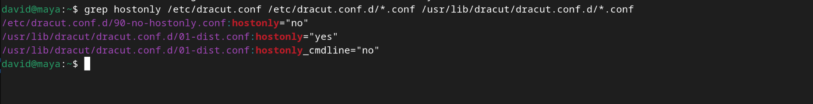

설정 파일이 만들어 졌다는 것을 확인했으니, 이제 `dracut`을 사용해서 실제로
설정이 적용되는지 확인하겠습니다.

(DEMO: ls -h first to keep the size of the old initrd, regen the initrds, do ls
-h again to compare the size)

이전 이미지의 크기와 비교해보면, 새로 생성한 이미지의 크기가 큰 것을 확인할 수
있습니다. 설정이 잘 적용되었다는 뜻 입니다. 저 큰 이미지가 부팅되고 나서도
메모리에 남아있다고 생각하실 수 있는데, 저 이미지는 설명했던 것처럼 루트
파일시스템을 마운트하는데만 사용되므로, 실제 루트 파일시스템이 마운트되고 나면
사라지게 되니 걱정하지 않으셔도 됩니다. 이 설정은 추후 패키지 매니저로 시스템을
업데이트할 때 설치되는 커널에도 적용됩니다.

이제 실제 머신에서 테스트하여 보겠습니다.

(DEMO: boot to the USB using the boot menu)

다 잘 되네요! 이제 이 USB로 리눅스를 사용하시면 됩니다. 리눅스가 마음에 들지
않으시면 그냥 USB를 빼버리시면 됩니다. 윈도 파티션을 그대로 냅뒀으니 윈도는
그대로 있던데로 잘 돌겁니다.

[^1]: https://manpages.ubuntu.com/manpages/focal/en/man8/update-initramfs.8.html
[^2]: https://wiki.ubuntu.com/RecoveryMode
