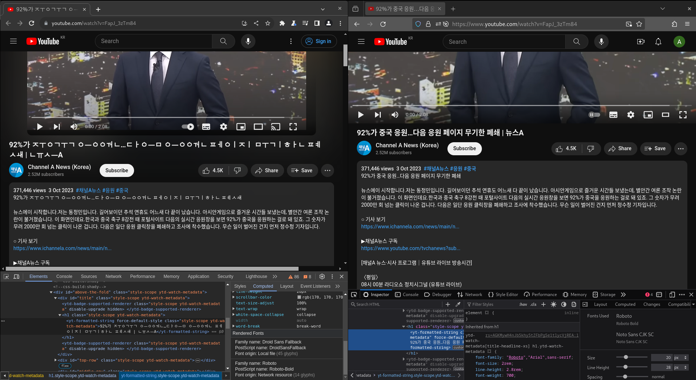
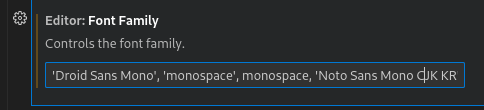

# 크로미움 기반 프로그램의 잘못된 fallback 폰트로 한글이 깨지는 문제
| OS | 데스크탑 표시언어 | 크로미움 패키지 |
|-|-|-|
| 페도라 | 영어 | 공식 RPM |

위 환경에서 한글이 아래와 같이 표시된다. 나는 크롬이 이 문제가 있기 시작할 때부터 그냥 파이어폭스로
갈아탔는데, 이 문제는 크로미움을 사용하는 모든 프로그램에서 나타난다는 것이다. 요즘 크롬으로 한글을
쓸 일이 생겼기도 하고, VSCode로도 한글을 쓸 일이 많아져서 해결을 조사를 하였다.
일단 Preliminary report는
[크로미움 버그](https://bugs.chromium.org/p/chromium/issues/detail?id=1522742)로
제출하였다.

> 디바이스에 IPv6가 부여됨

"부여됨" 부분이 깨짐.

> 92%가 중국 응원…다음 응원 페이지 무기한 폐쇄 | 뉴스A

"가"를 제외한 부분이 다 깨짐.

## 원인
모든 폰트로 모든 언어의 glyph를 모든 상황에서 표시할 수 없고, 리눅스 시스템에는 freetype과
fontconfig 등을 사용해 데스크탑 앱은 이를 사용해서 문자를 렌더링할 때 어떤 폰트를 사용해서
렌더링할지 정한다. 이를 font fallback이라고 한다. 하필이면 크로미움은 자체적인 fallback 규칙이
있는지, `Droid Sans Fallback`으로 표시할 수 없는 부분을 표시한다. Freetype이 Droid Sans로
한글을 렌더링하는데 간혹가다 문제가 있어 보인다[^3].

파이어폭스의 개발자 도구는 문장의 어느 부분이 어떤 폰트로 렌더링되었는지 확인할 수 있는 툴도
제공한다[^1]. 이 도구로 깨지는 부분의 글씨의 폰트가 어떤 폰트로 렌더링되었는지 확인할 수 있다.
깨지지 않는 부분의 폰트는 Google에서 온 Roboto를 사용하다가, Roboto로 렌더링할 수 없는 한글
부분을 모두 시스템 기본 폰트인 `Noto Sans CJK`를 사용하는 것을 확인할 수 있다.

## 방안
CJK 지원이 완벽한 폰트를 프로그램에 설정하여 렌더러한테 힌트를 주는 방법이 있다. 페도라 기본 포함된
`Noto Sans Mono CJK KR` 폰트가 잘 동작하는 것으로 보인다. 이는 페도라에 기본 포함된 유일한
기본 CJK 폰트이다.

### 크로미움
파이어폭스처럼 고급 폰트 설정이 없어 언어별 사용 폰트를 설정할 수 있는 UI가 없다. 플러그인으로
나와있는게 있지만, 최신 버전에서 동작하지 않는다[^2]. 기본 폰트를 `Noto Sans Mono CJK KR`로
변경하는 방법밖에 없는데, 그럴 경우 다른 non-latin, non-cjk 언어가 잘 표시될 것이라는 보장은
없다. 따라서 근본적인 해결 방안은 크로미움 개발자가 fallback 규칙을 고치거나 파이어폭스처럼 고급
폰트 설정을 넣는 것이다.

### VSCode(Electron)
`editor.fontFamily` 값 제일 끝에 `Noto Sans Mono CJK KR`를 추가한다. 다른 플러그인으로
한글을 표시한다면 그 플러그인 폰트 설정도 바꾸어야 할 것이다.

[^1]:  https://firefox-source-docs.mozilla.org/devtools-user/page_inspector/how_to/edit_fonts/index.html
[^2]: https://chromewebstore.google.com/detail/advanced-font-settings/caclkomlalccbpcdllchkeecicepbmbm
[^3]: https://wiki.archlinux.org/title/fonts#Fallback_font_order
