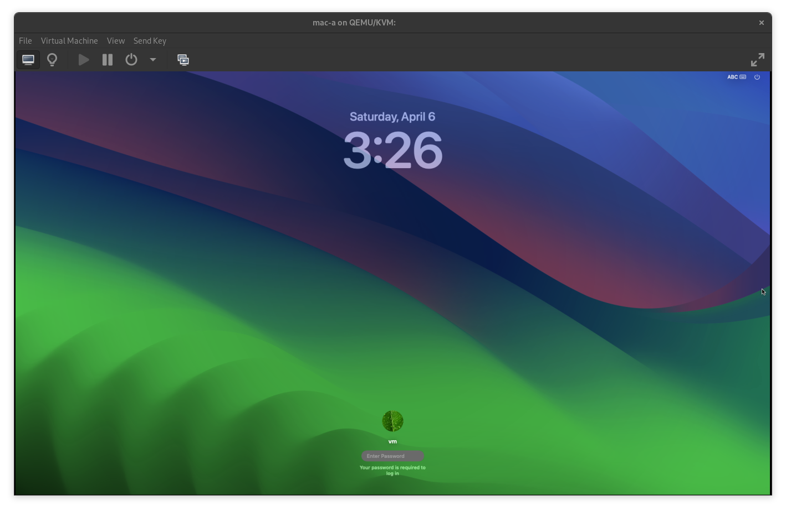
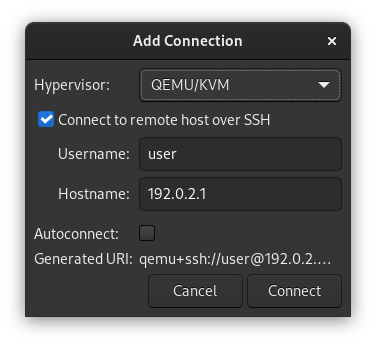
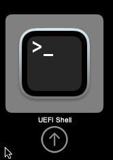
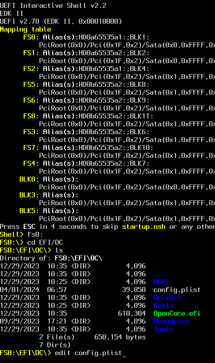
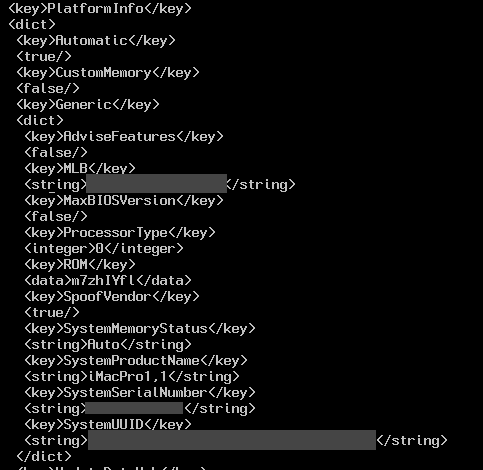
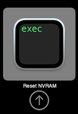
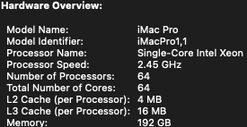

# Running Hackintosh on Cloud using QEMU and Libvirt


```
                <- Libvirt Domain Control ->
                <- SPICE/VNC ->
                <- USB Redirection ->
LOCAL MACHINE           (INTERNET)           Cloud VM
 virt-manager                                 libvirtd
 virt-viewer                                   qemu-kvm
                                                hackintosh
```

I've found myself in the mobile dev scene. I thought it was time to buy macbook
but I was reluctant to make such a financial commitment for something I'll
rarely use again after I'm done with the project. Hackintosh came up as a viable
option so I took a deep dive into the rabbit hole.

My choice of tools are Libvirt and qemu-kvm. I chose them because they're the
ones I use on the daily basis. The fronts like virt-manager and virsh are quite
nice, too. I've also decided to try running on a cloud VM so my mates can use it
when they need it.

My goal is to build and test React Native apps for IOS devices. So my mac
environment has to have all the tools for it: Xcode, pod, brew and all the other
shebang. Therefore I had to get **Sonoma** working because the latest version of
Xcode dropped support for older macos.

Apple Silicon is not discussed here because, as of the time of writing, no
virtualisation software supports Apple's proprietary ARM instructions. Apple's
recent push to move over to ARM is a real threat to Hackintosh community. Apple
will eventually drop support for x86 macs and when that time comes, this post
will no longer be relevant. Reverse engineering Rosetta is definitely a
challenge. The law suits that come after will be, too.

To those who are new to Hackintosh scene, emulating Mac has always been a
constant battle between Apple constantly breaking backward compatibility and the
community trying to fix broken stuff caused by that. The documents get outdated
pretty quick so if this post looks old or doesn't look right, I suggest quickly
moving onto new ones online.

## Acknowledgements
Many thanks to [kholia](https://github.com/kholia/OSX-KVM), the OpenCore
project, and the Hackintosh communities.

## Disclaimer
Building a Hackintosh involves use of arbitrary binary from untrusted sources. I
took the shortcut by using the binaries built by people on the internet since I
don't have to do anything "serious" with my Hackintosh, other then IOS app
building and debugging. At any rate, you may want to build the EFI image,
OpenCore, and all of its extension, reviewing all the code in the process...
well,

I recommend buying the real hardware rather than hacking your way to save some
money by using Hackintosh if you need Mac to do serious business. That way,
there's no funny business between you and Apple, and you will have someone to
sue when things go wrong - you're also paying for liability along with warranty
that comes with the products.

Another option is: "if you can't beat 'em, **DON'T** join 'em". This is the
option many devs choose to take. If you don't condone Apple's business
practices, show them by not having anything to do with them. Don't support IOS
and Mac. Don't buy their overpriced hardware. That's how you vote them out of
the competition.

## Requirements
When choosing the instance type for your hackintosh, note that at least 8GB of
RAM is required[^8] if you want to do anything at all with it. For CPU
configuration, it depends on the type of CPU the instance has.

### Choice of CSP
In order for kvm_intel or kvm_amd to work, the host must have virtualization CPU
extensions enabled(`svm` for AMD and `vmx` for Intel). Since we're looking to
run qemu-kvm on the cloud VM, the keywords we're looking for are "nested
virtualization" and, more specifically, "L2" because the guest(L2) is run on a
cloud VM(L1) which in turn runs on a bare metal hypervisor(L0). For stability
issues[^1], only a handful of CSPs offer VM types with nested virtualisation
enabled.

1. Azure[^2]: the most painless and cost-effective option as of 2024. Easy to
   request spot VMs, bargain spot prices, supported on both AMD and Intel
1. GCP[^3]: supported on Intel instances only
1. AWS: nested virtualisation support is officially supported only on bare metal
   instances[^4]. My experience is that you *can* use KVM on compute optimized
   instances[^5]. Worth a try if you feel so adventurous. Painful to launch spot
   VMs because spot VMs can only be purchased via fleet requests on AWS

If you look at the references closely, you'll see that nested virtualisation on
CSP hypervisors is a cutting-edge technology. Your options are pretty much
limited to the big 3.

### Azure
Running the vm on an E series instance was not feasible because the vCores are
hyper-threaded and credit limited.

**D4as_v5** w/ 14GB of RAM allocated to the vm was alright. **D8as_v5** w/ 28GB
was perfect for my use case(VSCode, building React Native app, Xcode, and one
iPhone SE 2nd simulator).

The bandwidth of "Standard SSD" on Azure is in fact not "standard" at all. You
need to use "Premium SSD" to get AWS's gp2/3 performance or the vm will
bottleneck upon disk IO. At least 50GB is required. After installing all the
apps for my set up it took up over 50GB meaning 100GB or more is required. So I
recommend starting with a **premium SSD 128GB**.

#### TCP Idle Timeout
Azure has aggressive default TCP idle connection cutout(4 minutes)[^6]. Rather
than fiddling with the cloud config, it'll be best if you just use even a more
aggressive keepalive interval on the software you have control over(sshd or
sysctl) so you don't have to worry about changing it every time you deploy a
public IP on Azure. Since ssh tunneling is used to control libvirt, uncomment
and change the values of the following settings in sshd_config.

```
TCPKeepAlive yes
ClientAliveInterval 30
ClientAliveCountMax 3
```

### Building QEMU(for Apple SMC device emulation)
Some distros don't ship qemu package with Apple SMC device emulation. This is
strange because this can only be done by patching qemu rather than the build
config. Someone at Red Hat went a great length to remove it. But the feature
is included in Fedora's PRM.

So, you're left with 2 options:

1. Pick a distro(**Fedora**) that ships qemu with Apple SMC
1. Build qemu yourself

To see if the qemu is built with SMC emulation, run:

```sh
echo -e 'info qtree\nq\n' |
	qemu-kvm
		-machine q35
		-device 'isa-applesmc,osk=ourhardworkbythesewordsguardedpleasedontsteal(c)AppleComputerInc'
		-display none
		-monitor stdio
```

The qemu should run and exit normally. The output should contain something like:

```
dev: isa-applesmc, id ""
  iobase = 768 (0x300)
  osk = "ourhardworkbythesewordsguardedpleasedontsteal(c)AppleComputerInc"
```

If you end up with errors it means that you have to build qemu yourself. If you
don't have to build qemu yourself, skip to [Download OSX
Images](#download-osx-images).

#### RHEL
For longevity of the VM image, I felt that it is necessary to set it up on
Rocky. Following is how I built mine for use on my Rocky instance. Remember that
this is a note, not a full-blown guide on how to Hackintosh so please try to
read between the lines before contacting me for help.

Continued in [build-qemu_rhel.md](build-qemu_rhel.md).

## Download OSX Images
On the host,

```sh
# Clone the repo
git clone https://github.com/kholia/OSX-KVM
cd OSX-KVM
# Run the script to download the installer image
./fetch-macOS-v2.py
# (choose Sonoma or higher)
# Convert the image
dmg2img BaseSystem.dmg
```

Bring the images down to the libvirt image pool.

```sh
sudo cp BaseSystem.img OpenCore/OpenCore.qcow2 /var/lib/libvirt/images
```

## Setting Up
Install libvirt and its friends on the instance.

```sh
sudo dnf install \
	libvirt \
	libvirt-daemon \
	libvirt-daemon-kvm \
	libvirt-daemon-driver-interface \
	libvirt-daemon-driver-network \
	libvirt-daemon-driver-nodedev \
	libvirt-daemon-driver-nwfilter \
	libvirt-daemon-driver-secret \
	libvirt-daemon-driver-qemu
```

Enable and fire them up.

```sh
sudo systemctl enable --now \
	libvirtd.service \
	virtqemud.service \
	virtlogd.service
```

Register your account to the groups.

```sh
sudo usermod -aG libvirt "$USER"
```

On your machine, install `virt-manager`.

```sh
# (RPM)
sudo dnf install virt-manager
# (DEB)
sudo apt-get install virt
# (Gentoo)-manager
sudo emerge virt-manager
# (OpenBSD)
sudo pkg_add virt-manager
# (mac)
brew install virt-manager
```

Run virt-manager.

### Add Libvirt Host Connection
Add connection to the host(`File` - `Add Connection`).



Connect to the libvirt daemon running on the host by double clicking on the name
or using the context menu.

## Generate Unique Values for the VM (optional)
The hackintosh will function just fine without changing the machine serial
numbers that come with kholia's OpenCore loader. If you don't want to take any
chances, go ahead and generate the serial for your hackintosh.

https://github.com/sickcodes/osx-serial-generator

Use the script `generate-unique-machine-values.sh` to a generate machine values.
You can use the script to build the OpenCore boot disks with the values inserted
to the images. Follow the repo's instruction to do that. Here, I'll demonstrate
how to set them up manually.

The script writes the values to csv and tsv files. Access them anytime by
reading the files.

## Create the hackintosh VM
Add a VM on the host. I'm laying down 2 ways to do this: create one from
scratch(DIY) using virt-manager and import the one I made.

### Import the XML
[mac.libvirt.xml](mac.libvirt.xml) is my latest working copy. The Upload the
domain xml to the host and import using virsh.

```sh
sudo virsh define mac.libvirt.xml
# Copying from your machine and pasting using the stdin also works:
# sudo virsh define /dev/stdin
```

After importing the xml, edit the memory and the number of vcpu to your needs.

Optional: manually edit the MAC of the net interface to the one generated
beforehand.

```xml
<!-- Paste the unique mac generated for your vm(optional) -->
<qemu:arg value="virtio-net-pci,addr=0x12.0x0,netdev=net0,id=net0,mac=THE_MAC"/>
```

### DIY(virt-manager)
See [libvirt-diy.md](libvirt-diy.md).

## Attach Volumes and Start the VM
Create a system volume for the vm. **50GB** is a good number to start with.
**100GB** to be on the safe side. Attach it to the vm as a SATA disk. You don't
have to register the disk in the boot order because only OpenCore can load the
OS.

Add another SATA disk with the macOS image(`BaseSystem.img`). Again, doesn't
have to be in the boot order as the image is loaded by OpenCore. The disk can be
removed from the vm after the installation.

You may now start the VM.

## Setting Serial Number (optional)
You can set the machine serial numbers by

1. Using the EFI shell
1. Mounting the OpenCore disk on the host and editing the config file

In the OpenCore boot image is the file `config.plist`, which contains the serial
numbers for the machine. The first method is illustrated here.



Drop to UEFI shell.



Find `config.plist` and run `edit` on it.



**F4** key to search string `PlatformInfo`. Type in the values you generated in
the [previous step](#generate-unique-values-for-the-vm-optional).

**F3** to exit. Save before exit.



`exit` to return to the OpenCore boot menu. Do a NVRAM reset.

## Done!
Boot to **BaseSystem** and install the OS. Start using the hackintosh.

## Cool Stuff
### Scaling up and down
Unlike Windows, macOS doesn't seem to be bothered by hardware change. The VM can
be scaled and down without any modification to the parameters or reinstallation.



Meaning, something like this is possible(tested by myself). And, of course, the
VM can be scaled down once the heavy lifting is done. This can be done
painlessly on Azure because, unlike AWS, Azure lets you change the size of a
spot VM without deleting or recreating the instance.

## Caveats/TODOs
With all the effort, at the end of the day, nothing beats buying a real mac.
There are many caveats when it comes to using Hackintosh in general. Even more
from using Libvirt's abstraction and running it on the cloud.

Unlike Windows, Mac(and IOS for that matter) doesn't have to support a wide
range of products. This enabled Apple devs to make assumptions about underlying
hardware and take many shortcuts when maintaining the kernel. The virtualization
software products in the market are not simply cut out for emulating Mac.

The qemu passthrough part of the XML looks ugly but this is the cost of running
Hackintosh on Libvirt. In my opinion, Libvirt is a good tool and the benefit of
using it outweighs the cost.

### Q35 pcie-root-port
When the machine type is set to Q35, libvirt "forcibly" adds pcie-root-port to
the root PCI-E controller. This is to implement PCI-E device hotplug[^10] and
modern kernels have no issue walking through these "root ports". For Mac, the
closest thing it has to hot plug are Thunderbolt devices and supporting these
"root ports" doesn't make any sense on Mac. All the PCI-E devices Libvirt
attaches to the VM are attached on root ports, which are non-existent on Mac
hardware hence rendering them useless for Hackintosh.

To get around this issue, the XHCI controller and the input devices need to be
attached directly to the PCI-E root via qemu command line passthrough

Someone pointed out the issues of Libvirt forcing root ports, but the libvirt
devs said no[^9].

### XHCI Related Issue
The USB 2.0 controller support has been dropped since Sonoma(14) so the input
devices(usb-kbd and usb-tablet) need to be attached directly to the XHCI
controller[^11].

There is a discrimination as to types of device that can be attached to the
controller and the ones that can only be attached to a hub. The XNU kernel is
unable to enumerate a USB drive when it is attached to the controller. So all
the usb-redir devices are attached to the usb-hub, which operates at full-speed.

### No Sound
AppleALC is included in the boot image, but for reasons unknown it doesn't seem
to be working in Sonoma(14). This might be a simple matter of adding the qemu
hda codec to AppleALC. It seems that the qemu's hda never made it to
AppleALC in the first place[^13].

### USB Redirection
See [usbredir.md](usbredir.md).

### SMM Instruction Crash Bugs
QEMU crashes when the secboot variant of stock edk2-ovmf is used. When the Mac
boots up and seconds later, the SMM[^7] instructions are issued and qemu crashes
with SIGABRT. This appears to be caused by a bug in the kvm module, not QEMU.

https://gitlab.com/qemu-project/qemu/-/issues/1198

So the SMM and secure boot have to be turned off.

```xml
<loader readonly="yes" secure="no" type="pflash">...</loader>
...
<smm state="off"/>
```

### Notes on Migration/Teleportation
The instance cannot be saved to disk because of the `invtsc`.

VMWare calls it teleportation. Others call it migration. It being: pausing and
saving the state of the vm to continue its execution on another bare metal
hypervisor.

The CSP could migrate your VM running a guest without notice. In such event,
your Hackintosh will suffer the side effects as there are parameters that make
the qemu guest difficult to save in order to migrate.

## Links
- https://hackintosh.com/
- https://www.tonymacx86.com/

[^1]: https://linux-kvm.org/page/Nested_Guests#Limitations
[^2]: https://azure.microsoft.com/en-us/blog/nested-virtualization-in-azure/
[^3]: https://cloud.google.com/compute/docs/instances/nested-virtualization/overview
[^4]: https://aws.amazon.com/about-aws/whats-new/2021/02/introducing-amazon-ec2-m5n-m5dn-r5n-and-r5dn-bare-metal-instances/
[^5]: https://repost.aws/questions/QUkOwmVhagQbOumNhdfc4YcA/
[^6]: https://carsonip.me/posts/azure-tcp-idle-timeout-tcp-keepalive-python/
[^7]: https://en.wikipedia.org/wiki/System_Management_Mode
[^8]: https://en.wikipedia.org/wiki/MacBook_Air_(Intel-based)#Retina_(2018%E2%80%932020)
[^9]: https://listman.redhat.com/archives/libvir-list/2020-February/198033.html
[^10]: https://libvirt.org/pci-hotplug.html
[^11]: https://github.com/kholia/OSX-KVM/pull/238
[^12]: https://github.com/kholia/OSX-KVM/blob/master/macOS-libvirt-Catalina.xml#L166
[^13]: https://github.com/acidanthera/AppleALC/wiki/Supported-codecs#currently-supported-codecs-2024-02-05-v189
