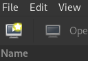

Things to set/look out for:

- "Manual Install": as OpenCore loader can only deal SATA disks, you'll have to
  add the install media yourself after the creation process
- "Generic or unknown OS"
- Memory: leave about 2GB to the host
- CPUs: match or fewer than host's count
- Disk image size: create one during the process or manually after creation
- Tick "Customize configuration before install", Finish
  - Click on "Apply" before leaving the view
  - Chipset: Q35
  - Firmware: UEFI
  - Delete the NIC, audio, tablet, usb redirection
  - Change the IDE disk to SATA
  - Manually edit the xml
    - Change the EFI images to the non secboot variant
    - Turn smm off

```xml
<loader readonly="yes" secure="no" type="pflash">/usr/share/edk2/ovmf/OVMF_CODE.fd</loader>
<nvram template="/usr/share/OVMF/OVMF_VARS.fd"></nvram>
...
<smm state="off"/>
```

Start editing the XML manually. Here's the breakdown of the changes.

Add the xmlns spec. Without this, `<qemu:commandline>` tag won't persist.
Without the tag, the xmlns spec won't persist either, so add the command line
passthrough first.

The qemu commandline passthrough is unavoidable because it is not possible to
set up Apple SMC and custom CPU flags in Libvirt. It is also to circumvent the
issue of libvirt's mandatory use of pcie-root-ports for the Q35 machine type.
See [cloud+libvirt.md#caveats](cloud+libvirt.md#caveats) for detail.

The PCI addresses are crafted so that they won't conflict with libvirt's
allocation.

```xml
<domain xmlns:qemu="http://libvirt.org/schemas/domain/qemu/1.0" type="kvm">
  ...
  <qemu:commandline>
    <qemu:arg value="-cpu"/>
    <!-- "Intel Cascade Lake-based Xeon W" of Mac Pro 2019 -->
    <qemu:arg value="Cascadelake-Server-noTSX,kvm=on,vendor=GenuineIntel,+invtsc,vmware-cpuid-freq=on,+ssse3,+sse4.2,+popcnt,+avx,+aes,+xsave,+xsaveopt,check"/>
    <qemu:arg value="-device"/>
    <qemu:arg value="isa-applesmc,osk=ourhardworkbythesewordsguardedpleasedontsteal(c)AppleComputerInc"/>
    <qemu:arg value="-smbios"/>
    <qemu:arg value="type=2"/>
    <qemu:arg value="-device"/>
    <qemu:arg value="qemu-xhci,id=xhci,addr=0x10.0x0"/>
    <qemu:arg value="-device"/>
    <qemu:arg value="usb-kbd,bus=xhci.0"/>
    <qemu:arg value="-device"/>
    <qemu:arg value="usb-tablet,bus=xhci.0"/>
    <!--
        Attach the usbredir devices to a hub connected to a separate XHCI
        controller so that the kernel can enumerate them. Connecting them
        directly to the controller will result in kernel complaining in loop.
    -->
    <qemu:arg value="-device"/>
    <qemu:arg value="qemu-xhci,id=usbr,addr=0x11.0x0"/>
    <qemu:arg value="-device"/>
    <qemu:arg value="usb-hub,bus=usbr.0,port=1"/>
    <qemu:arg value="-device"/>
    <qemu:arg value="usb-redir,bus=usbr.0,port=1.1,chardev=usbredirchardev1,id=usbredirdev1"/>
    <qemu:arg value="-device"/>
    <qemu:arg value="usb-redir,bus=usbr.0,port=1.2,chardev=usbredirchardev2,id=usbredirdev2"/>
    <qemu:arg value="-device"/>
    <qemu:arg value="usb-redir,bus=usbr.0,port=1.3,chardev=usbredirchardev3,id=usbredirdev3"/>
    <qemu:arg value="-device"/>
    <qemu:arg value="usb-redir,bus=usbr.0,port=1.4,chardev=usbredirchardev4,id=usbredirdev4"/>
    <qemu:arg value="-device"/>
    <!-- Paste the unique mac generated for your vm(optional) -->
    <qemu:arg value="virtio-net-pci,addr=0x12.0x0,netdev=net0,id=net0,mac=44:E6:6E:4F:87:9C"/>
    <qemu:arg value="-netdev"/>
    <qemu:arg value="user,id=net0"/>
    <qemu:arg value="-chardev"/>
    <qemu:arg value="spicevmc,name=usbredir,id=usbredirchardev1"/>
    <qemu:arg value="-chardev"/>
    <qemu:arg value="spicevmc,name=usbredir,id=usbredirchardev2"/>
    <qemu:arg value="-chardev"/>
    <qemu:arg value="spicevmc,name=usbredir,id=usbredirchardev3"/>
    <qemu:arg value="-chardev"/>
    <qemu:arg value="spicevmc,name=usbredir,id=usbredirchardev4"/>
  </qemu:commandline>
</domain>
```

Turn off memballoon.

```xml
<memballoon model="none"/>
```

That's pretty much it!
