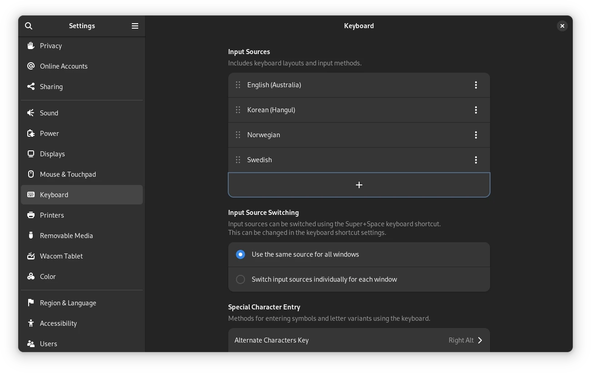
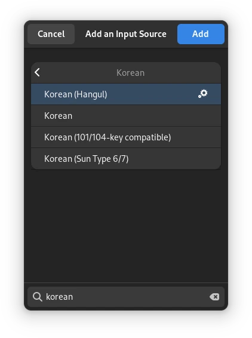
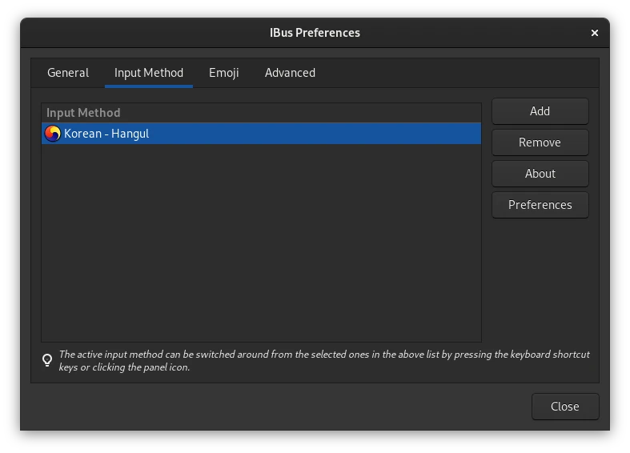

# 리눅스 한글 입력기 문제 해결 (GNOME+IBUS)
리눅스 쓰는데 한글이 안되요? 그럼 이 글을 통해 잘 해결해 보시기 바랍니다. 한글
입력이 어떤 과정을 통해 이루어지고 트러블슈팅하는 방법을 알려 드립니다.

리눅스 환경에서 GUI 앱에 한글이 입력되는 과정은 아래와 같다.

```
APP               API setup                       IM Daemon
GTK based         ibus-gtk[234]
QT based     ->   ibus-qt         ->   IPC   ->   ibus
Xlib based        XCreateIC()
                  XOpenIM()
                  XCloseIM()
```

이 문서에서는 Gnome에 기본적으로 포함된 IBus만 다룬다. 다른 IM 프로그램도
많으나, 다른 IM 프로그램을 사용해서 얻는 이점이 없으면 데스크탑 환경에서
기본으로 사용하는 IM을 사용하는 것이 이상적이다. 특히나 GNOME 환경에서 한글
입력에 IBus가 아닌 scim이나 fcitx을 사용해서 얻는 이점은 없다. WSL을 사용할 때
어쩔 수 없이 fcitx를 사용해야 한다는 글이 인터넷 곳곳에 숨어 있는데, fcitx도
호환성을 위해 기존 X11 환경 변수 등을 사용하므로 이 문서에서 논하는 문제 해결
내용이 도움이 될 것이다.

앱이 IM(input method) 없이 초기화되면 사용자는 앱에 단순한하게 라틴 문자만
입력할 수 있다. CJK(Chinese-Japanese-Korean) 언어의 문제점은 라틴 문자를
사용하는 언어와는 다르게 복잡한 알파벳 시스템을 가지고 있다(한/영 입력 변환,
한자 입력, 히라/카타 선택 등). 이 때문에 한글 입력에는 언어 특성에 맞게 제작된
IM이 필요하다.

리눅스의 FOSS 생태계의 문제로 인해 윈도와 macOS와는 다르게 다양한 IM이 존재하며
다양한 GUI 툴킷이 존재한다. 이로 인해 앱마다 문제가 다를 수 있으며 해결 방법도
다르다. 아래 절차는 큰 사용 케이스를 커버하였다.

## 트러블슈팅
### ibus-hangul 설치 확인 (GNOME)
IBus의 한글 플러그인은 **ibus-hangul** 패키지이다. 배포판에서 시스템 언어를
한국어로 변경하여도 ibus-hangul을 자동으로 설치해주지 않는다면 직접 설치한 뒤
GNOME 키보드 설정에서 ibus-hangul을 사용하도록 설정해야 한다.

이미 설치가 되어 있으면 다음으로 절차로 이동.

```bash
dnf install ibus-hangul
```





### IBus 환경변수
`dnf repoquery -l ibus` 명령으로 확인해보면, IBus는 X11와 연동하기 위해 환경
변수를 xinit에 추가한다. Wayland가 이 레이어와 호환하기 위해 각 배포판에선 각자
다른 호환 레이어를 구성해 사용 중에 있으므로, X11과 Wayland 모두 이 설정이 적용
됨[^1].

`/etc/X11/xinit/xinput.d/ibus.conf`

```conf
XIM=ibus
XIM_PROGRAM="/usr/bin/ibus-daemon"
ICON="ibus"
XIM_ARGS="-r --xim"
PREFERENCE_PROGRAM=/usr/bin/ibus-setup
SHORT_DESC="IBus"
GTK_IM_MODULE=ibus
NOT_RUN=gnome3
# IMSETTINGS_IGNORE_SESSION concatenate the current session name and type x11 or
# wayland. The current session name is calculated by get_destop()
# in /usr/libexec/imsettings-functions and the value is case-sensitive.
IMSETTINGS_IGNORE_SESSION=KDE-wayland

if test -f /usr/lib64/qt5/plugins/platforminputcontexts/libibusplatforminputcontextplugin.so || \
   test -f /usr/lib/qt5/plugins/platforminputcontexts/libibusplatforminputcontextplugin.so || \
   test -f /usr/lib64/qt4/plugins/inputmethods/libqtim-ibus.so || \
   test -f /usr/lib/qt4/plugins/inputmethods/libqtim-ibus.so;
then
    QT_IM_MODULE=ibus
else
    QT_IM_MODULE=xim
fi
```

... 그러나 여기서 중요한 변수는 사실상 `QT_IM_MODULE`이며, 다른 변수는 데스크탑
환경에서 대부분 제거한다. `GTK_IM_MODULE`는 여전히 override용으로 사용되며, 여러
IM이 설치되어 있는 상황에서 `GTK_IM_MODULE=ibus gedit`와 같은 식으로 GTK 앱에
ibus를 강제로 사용하게 할 수 있다.

### GTK IM 모듈
GTK는 `ibus-gtk*` 모듈을 제공한다. GTK가 초기화될 때
`/usr/lib64/gtk-*/*/immodules/` 디렉터리 안에 있는 모듈 중 자동으로 하나를
택한다. 근데 적당한 모듈이 없다면 GTK 앱은 조용히 라틴만 입력할 수 있는 "simple"
IM으로 초기화 된다.

```sh
$ find /usr/lib64/gtk-*/*/immodules/ -type f
/usr/lib64/gtk-2.0/2.10.0/immodules/im-ibus.so
/usr/lib64/gtk-3.0/3.0.0/immodules/im-ibus.so
/usr/lib64/gtk-4.0/4.0.0/immodules/libim-ibus.so
```

만약 이 파일들이 보이지 않으면 패키지를 다시 설치해 본다.

```sh
dnf reinstall 'ibus-gtk*'
```

### GTK IM 설정
GTK의 IM 관련 설정은 크게

- `GTK_IM_MODULE` 환경변수
- `org.gnome.desktop.interface.gtk-im-module` dconf 설정 값

#### 환경변수
```sh
$ env | grep GTK_IM_MODULE
QT_IM_MODULE=ibus
```

위 명령을 실행했을 때 아무것도 나오지 않아야 하거나 `GTK_IM_MODULE=ibus`로
나와야 함.

제일 이상적으로 `GTK_IM_MODULE` 환경변수는 설정되지 않아야 하며 GTK가 자동으로
IM 모듈을 선택하게 냅둬야 한다. 만약 변수가 설정되어 있는데 그 값이 "ibus"로
되어있지 않다면 GTK 앱에서 IM을 사용할 수 없을 것이다. 그 경우 어디서 이 변수를
export하는지 추적해 보고, 그 export하는 부분을 지운다[^2].

```sh
PS4='+$BASH_SOURCE> ' BASH_XTRACEFD=7 bash -xl 7>&2
```

#### dconf
`gsettings` 혹은 `dconf-editor`로 `org.gnome.desktop.interface.gtk-im-module`가
설정되어 있는지 확인한다. 되어 있으면 설정을 지워준다.

```bash
# 확인
gsettings get org.gnome.desktop.interface gtk-im-module
# 초기화
gsettings reset org.gnome.desktop.interface gtk-im-module
```


### 설정 확인
GTK는 `gtk-query-immodules-3.0-64`와 `gtk-query-immodules-2.0-64` 디버깅
프로그램을 제공한다. 이 둘을 실행했을 때 아래와 같이 나와야 함.

```sh
$ gtk-query-immodules-3.0-64
"/usr/lib64/gtk-3.0/3.0.0/immodules/im-ibus.so"
"ibus" "IBus (Intelligent Input Bus)" "ibus" "" "ja:ko:zh:*"

$ gtk-query-immodules-2.0-64
"/usr/lib64/gtk-2.0/2.10.0/immodules/im-ibus.so"
"ibus" "IBus (Intelligent Input Bus)" "ibus" "" "ja:ko:zh:*"
```

### QT 관련
Qt 앱이 ibus와 통신하기 위해 필요한 모듈들이 실제로 시스템에 존재하는지 확인해
본다.

```sh
$ dnf repoquery -l ibus-qt | grep lib64
/usr/lib64/libibus-qt.so.1
/usr/lib64/libibus-qt.so.1.3.0
/usr/lib64/qt4/plugins/inputmethods/libqtim-ibus.so
```

플러그인을 다시 설치해 본다.

```sh
dnf reinstall ibus-qt
```

`QT_IM_MODULE` 환경변수가 설정되고 있는지 확인해본다.

```sh
$ env | grep QT_IM_MODULE
QT_IM_MODULE=ibus
```

환경변수가 없다면 ibus를 다시 설치하여 `/etc/X11/xinit/xinput.d/ibus.conf`
파일을 복구해 본다.

```bash
dnf reinstall ibus
```

### 레거시 X11 앱 (Xlib, Motif 기반)
xterm과 같이 지금까지도 유지가 되고 있는 앱들은 Xlib 라이브러리의 함수를 직접
사용하여 IM을 사용하는데, 이 경우 앱에게 환경변수를 사용해 무슨 IM을 사용할지
알려주어야 한다. 이에 `XMODIFIERS` 변수가 사용된다.

```sh
$ env | grep XMODIFIERS
XMODIFIERS=@im=ibus
```

이 변수는 어떠한 설정 파일에서도 볼 수 없으며, GDM이 설정하도록 하드코드된
것으로 보인다. 따라서 사용하는 GDM이 이 환경변수를 설정하지 않는다면 레거시 앱을
실행하기 전에 수동으로 설정하는 방법이 있다.

```sh
XMODIFIERS=@im=ibus xterm
```

현대 배포판에서 사용되는 모든 IM이 나오기 전에는 X11의 확장으로 나온 XIM이
사용되었다. 현대 IM은 XIM에 맞춰 만들어진 레거시 앱들과도 호환성을 유지하도록
구현되어 있다. 레거시 앱에서 IM을 사용할 수 있는지의 여부는 `objdump`를 사용해
앱이 XIM 함수를 호출하는지 확인하는 방법이 있다. 제일 중요한 함수는

- XCreateIC
- XOpenIM
- XCloseIM

```sh
$ objdump -T /usr/bin/xterm | grep -E 'IM|IC'
... XSetIMValues
... XUnsetICFocus
... XGetIMValues
... XRegisterIMInstantiateCallback
... XCreateIC
... XCloseIM
... XSetICValues
... XSetICFocus
... XOpenIM
```

### X11 Forwarding 시 한글 입력
multi-user.target (예전 말로 "runlevel 3")으로 동작하고 있는 시스템에선 GDM이
실행되지 않으며, 따라서 ibus도 자동으로 실행되지 않는다. 그래서 `ibus-daemon`을
수동으로 실행해야 한다.

```sh
$ ibus start
```

이 경우 ibus의 자체 설정이 사용되므로 `ibus-setup`를 사용해 한글 입력기를 추가해
주어야 한다.

```sh
$ ibus-setup
```



GDM이 설정해주던 환경변수도 직접 설정해서 실행해야 한다. 예시:

```sh
$ XMODIFIERS=@im=ibus xterm
```

## 문제가 발생할 수 있는 시나리오
### 다른 데스크탑 환경과 충돌
GNOME은 ibus를 사용하며 Xfce는 XIM을 고수한다. GNOME에 한글 입력기를 설치해서 잘
사용하다가 Xfce를 설치하면 `org.gnome.desktop.interface.gtk-im-module` 설정이
"xim"으로 변하면서 GTK 앱의 한글 입력이 먹통이 된다.

### 여러 IM 동시 사용
중국어, 일본어, 한국어를 모두 구사하는 사람이며 부득이하게 fcitx 등을 동시에
사용해야 할 때 비 GTK 기반 앱들을 사용하기 힘들어진다. GTK는 시스템에 어떤 IM이
사용되는지 자동으로 감지하는 기능이 있지만 Qt와 레거시 X 앱에는 그런 매커니즘이
존재하지 않는다. 이 경우 환경변수를 잘 설정하여 사용해야 한다. 이는
[ArchWiki](https://wiki.archlinux.org/title/fcitx)에 잘 설명되어 있음.

## 참조
- https://github.com/orgs/libhangul/repositories
- https://lwn.net/Articles/503320/
- https://docs.gtk.org/gtk4/property.Settings.gtk-im-module.html
- https://en.wikipedia.org/wiki/Korean_language_and_computers#Programs

[^1]: https://github.com/korean-input/issues/issues/6
[^2]: https://unix.stackexchange.com/questions/813/how-to-determine-where-an-environment-variable-came-from
[^3]: https://edykim.com/ko/post/fix-hangul-input-spacing-order-issue-in-st-with-fcitx/

### GTK-QUERY-IMMODULE(1)
> Normally, the output of gtk-query-immodules-2.0 is written to
> libdir/gtk-2.0/2.10.0/immodules.cache, where GTK+ looks for it by default. If
> it is written to some other location, the environment variable
> GTK_IM_MODULE_FILE can be set to point GTK+ at the file.

### IM 종류
모든 IM은 libhangul를 사용하여 한글 입력기를 구현함.

- **IBus**: Gnome 기본
- SCIM: KDE 기본
- fcitx: WSL과 사용됨
- "nabi" XIM: 오래된 문서에서 가끔 찾아볼 수 있다
- XIM: 최초 X11 입력기. 지금 사용되는 모든 IM이 지원함

## 배경
내가 리눅스를 처음 접해서 리눅스를 한글로 사용할 때부터 감수한 불편함이 있었음:
한글 입력기에 문제가 생겨서 한글을 입력하지 못하는 문제. 전에는 귀찮기도 하고 이
문제를 어떻게 접근해야 할지도 모르겠고 해서 그냥 불편한대로 살았다. 컴퓨터로
계속 한글을 쓰고 살려면 문제를 제대로 파악해서 해결해야 한다는 단념으로 IM이
뚜껑 밑에서 어떻게 동작하는지 분석을 해보았다.
