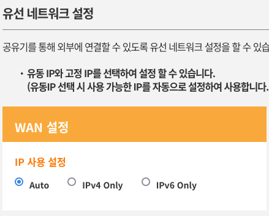
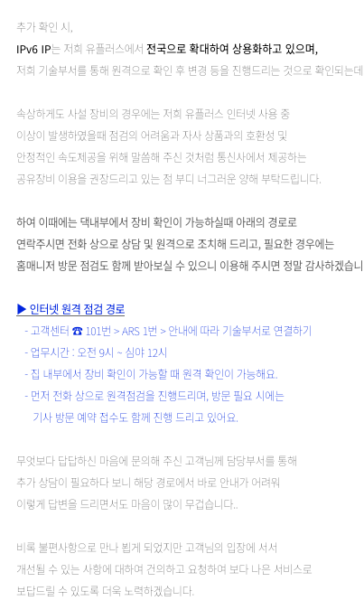

# 한국에서 IPv6 쓰기 여정
올 것이 왔다. AWS에서 IPv4 풀 운영비가 감당이 안 되는지, 2024년 2월부터 모든
IPv4에 과금을 시작한다고 한다.

https://aws.amazon.com/blogs/aws/new-aws-public-ipv4-address-charge-public-ip-insights/

주소 하나당 월 $3.6의 비용이 추가적으로 발생한다는 얘기인데, 큰 규모의
사용자에게는 적지 않은 비용이다. 나는 이럴 줄 알고 internet facing 인스턴스같이 IPv4 사용이
불가피한 것을 제외한 모든 backing 자원을 IPv6 only로 가려는 시도를 오래전에 하였다. Telstra는
이미 몇년 전부터 대부분 회선을 듀얼스택으로 서비스하기 시작해서 큰 불편을 못 느꼈다. 하지만 최근에
내가 한국에 거주하게 되면서 LG U+의 가정인터넷 상품을 사용하여 개발 활동을 하고 있는데, 집이나,
LTE나 모두 듀얼스택으로 서비스하지 않았다. 그래서 시작한 여정을 여기 정리하여 보았다.

## ISP의 도움 없이
한국 IT 산업 전반에 실력있는 구루가 없다는 사실은 내가 이미 오래전부터 체념하고 살고있었다. 그래서
일단 ISP에 도움을 청하지 않고 IPv6 only 자원을 접근할 수 있는 방법이 얼마나 있는지 조사해
보았다.

### HE Tunnel Broker
https://www.tunnelbroker.net/

개인이 현재로써는 최선의 방법. 단점은 가장 가까운 터널이 일본에 있고, 무료인 만큼 속도제한이 있다.
하지만 그래도 안정적인지 HE 터널을 사용해 웹사이트를
[서비스하는 곳](https://linuxreviews.org/LinuxReviews)이 있다.

6in4 터널이며(41번) 내 집에 있는 다보링크 LG U+ 공유기도 다행이게도 잘 처리가 된다.

### KISA, KINX
https://krnic.or.kr/fileDownload/IPv6.pdf

내 기억으로는 [KISA](https://bgp.he.net/exchange/6NGIX)와
[KINX](https://bgp.he.net/exchange/KINX)에서 일반을 상대로 위 HE에서처럼 무료 IP tunnel
서비스를 했었다. 지금은 어디로 사라졌는지 알수가 없다. 찾으면 추후에 여기 정리해 둠.

### VPC NAT64
https://aws.amazon.com/vpc/pricing/

제일 깔끔한 방법이지만, 비싸다. 이 비용을 감당할 수 있는 기업 사용자가 쓰지 알맞을 것 같다.

## LG U+를 달구다
위에 나열한 것과 같이 방법이야 많다. 하지만 제일 쉽고 편하고 안정적인 방법은 ISP에서 주는 IPv6
주소를 사용하는 것이다. **아무것도 안해도 되니까**. 문제는 내 집 회선에 IPv6 주소가 안붙는다.

찾아서 나온 글이 딱 하나다. 자신이 U+ 쓰는데 IPv6 주소가 잡혀있다고 말한 인터넷의 흑자이 희망이
되어 U+에 문의를 하기 시작했다.

https://gigglehd.com/gg/soft/14973116

일단 장비 지원 문제 등 모든 문제를 배제했다. L2 캡쳐를 떠보니 나오는 RA도 없고 DHCPv6도 존재하지
않는다.

### 공유기
ISP용으로 만든 공유기 모델의 웹 인터페이스는 idiot-proof 식으로 디자인되는 경우가 허다한데,
LG U+ 다보링크 공유기도 예외는 아니다.



설정을 이렇게 너무 단순하게 주면 공유기 활용도가 떨어지는 사실은 물론이고, 무슨 이유에서 IPv6 only
옵션을 만들어서 사람들 혼란하게 만드는 걸까? 지금이 IPv6 only 만으로도 잘 살 수 있는 먼 미래도
아니고 말이다. 실제로 LG U+ 직원들이 했던 말이다. 무슨 이유에서인지 IPv6 only로 설정된 공유기
때문에 고장처리를 자주 했다고 한다.

### 관련지식이 있는 직원이 없다
그래서 전화질을 시작했다. 나는 처음에 rfc6555 구현이 안 되던 옛날 시절을 생각해서 U+쪽에서 막은
느낌이 들었다. 일단 인터넷 어디를 찾아보아도 LG U+가 IPv6 서비스를 정식으로 시작했다는 사료를 찾을
수가 없어 일단 직접 문의로 서비스 여부나 한번 판단해 보았다.



말투가 왜 저러시지. 쨋든, 한단다. 그래서 사용을 원하면 일단 고장신고 부서를 통해서 지원받으라고
했다. 그래서 전화했다.

처음 전화 연결을 해서 들은 답변은, 서비스하기는 하는데 내가 요청해서 시스템 설정을 하면 IPv6
만 사용할 수 있다는 것이었다. 그래서 내가 v6 주소만 쓰면 인터넷 사용이 어렵다고 얘기했더니,
그래서 IPv6 때문에 생기는 고장 처리를 많이 했다는 답을 들었다. 지금 생각해 보면 담당 직원이
모르시고 공유기에 UI 저렇게 빠져있는 것을 보고 그런 답변을 하신 것 같다.

두번째로 전화해서 연결된 상담직원은 다짜고짜 스스로 부서에 물어보거나 직접 찾아보지 않고, 고장 신고가
아니지만 일단 원격 지원을 받아보라고 해서 나를 원격지원 하청으로 빠르게 넘기려 했다. 원격지원
프로그램이 윈도여서 내가 윈도 PC를 마련해야 하는 상황인데, 상담원은 일단 모르겠고, 지원 프로그램
켜달라고 해서 일단 윈도 돌아가는 머신을 마련해 주었다. 원격 프로그램에서도 내 이름을 한글로 입력하라
해서 IME 추가하는데 애먹었다. 그래서 엔지니어와 통화를 했는데, 전문지식이 있으신 엔지니어와 통화 후
답을 얻었다: LG U+ 쪽 시스템에서 IPv6를 따로 설정하는 프로세스는 없다.

일단 101 상담사분들은 아시는 게 없고, 주변에 아는 사람도 없어서 일단 건수 처리하기 위해 원격지원
부서로 넘겼던 것 같다. 한국 ISP는 기술지원 부서를 운영할 이유가 없어서 생긴 수난이라 생각된다.
바로 엔지니어하고 전화 통화해서 "그런 거 없어요"라는 답변만 받으면 빠르게 처리될 문제였는데, 그런
프로세스가 없어서 상담원들도 당황하셨겠다.

### 결론
내가 내린 결론은, 집에 LG U+ 사용하고, 공유기 설정도 Auto로 되어있는데도 PC에 v6 주소 안잡히면
그 지역에서 서비스 안한다는 얘기다. 한마디로 U+는 전국 서비스를 한다는 입장이지만, 실제로는 지역차가
있다는 얘기다.

상황이 얼추 맞아 떨어진다. 자료를 봐도 LG U+는 IPv6 전환 사업에 관심 많이 없다는 것을 볼 수 있다.
ISP라는 회사가 일반 컨텐츠 제공사보다 프리픽스를 적게 보유하고 있다.

https://krnic.kisa.or.kr/jsp/business/management/isCurrentIpv6.jsp

## 다른얘기
국내에서 많이 접근하는 사이트들의 IPv6 지원 현황을 알아보려고 스크립트를 만들었다.

[aaaa_popular-sites.sh](aaaa_popular-sites.sh)

```
youtube.com          	2404:6800:4005:81c::200e
google.com           	2404:6800:4005:81a::200e
naver.com
dcinside.com
namu.wiki            	2606:4700::6810:b52d,2606:4700::6810:b42d
coupang.com
fmkorea.com
daum.net
tistory.com
kakao.com
kr-weathernews.com
arca.live
ilbe.com
inven.co.kr
fabulouslink.xyz     	2606:4700:3032::ac43:d2e5,2606:4700:3037::6815:531b
ruliweb.com
aliexpress.com
twitter.com
facebook.com         	2a03:2880:f156:82:face:b00c:0:25de
instagram.com        	2a03:2880:f256:e0:face:b00c:0:4420
tvwiki.top
nate.com
dogdrip.net
donga.com
draplay.info         	2606:4700:20::ac43:493e,2606:4700:20::681a:2d0,2606:4700:20::681a:3d0
gmarket.co.kr
google.co.kr         	2404:6800:4005:80c::2003
sauceflex.com
twitch.tv
ppomppu.co.kr
nexon.com
humoruniv.com
ssg.com
theqoo.net
av19.org
sflex.us
yadongtube.net
linkkf.app           	2606:4700:3108::ac42:2b7f,2606:4700:3108::ac42:2881
buzzvil.com
newtoki315.com       	2606:4700:3037::ac43:9503,2606:4700:3037::6815:1d7f
wikipedia.org        	2001:df2:e500:ed1a::1
manatoki315.net      	2606:4700:3033::ac43:8517,2606:4700:3035::6815:dcc
chosun.com
newtoki314.com       	2606:4700:3033::6815:10a6,2606:4700:3032::ac43:d6dc
manatoki314.net      	2606:4700:3034::6815:45a8,2606:4700:3037::ac43:d28e
avsee.in
newtoki313.com       	2606:4700:3033::6815:1d57,2606:4700:3036::ac43:94b2
appier.net           	2600:1901:0:f379::
manatoki313.net      	2606:4700:3037::6815:109c,2606:4700:3037::ac43:d5ac
pornhub.com
etoland.co.kr
samsung.com
yatv.net
ravielink.xyz        	2606:4700:3032::ac43:9949,2606:4700:3037::6815:50bd
afreecatv.com
newtoki316.com       	2606:4700:3036::ac43:ab9c,2606:4700:3032::6815:47c6
lotteon.com
auction.co.kr
clien.net
danawa.com
openai.com
postype.com
manatoki316.net      	2606:4700:3033::6815:2e33,2606:4700:3037::ac43:dfdf
netflix.com          	2600:1f14:62a:de82:822d:a423:9e4c:da8d,2600:1f14:62a:de81:b848:82ee:2416:447e,2600:1f14:62a:de80:69a8:7b12:8e5f:855d
linkmine.co.kr
musinsa.com
instiz.net           	2606:4700:10::ac43:f19,2606:4700:10::6816:c1d,2606:4700:10::6816:d1d
oliveyoung.co.kr
tvmon.help
shinhancard.com
twidouga.net         	2606:4700:10::ac43:1af2,2606:4700:10::6816:2255,2606:4700:10::6816:2355
inlcorp.com
bobaedream.co.kr
asianhd1.com         	2606:4700:20::ac43:4b16,2606:4700:20::681a:98f,2606:4700:20::681a:88f
cjlogistics.com
tdgall.com
yadongkorea.red
mediacategory.com
kbcard.com
dhlottery.co.kr
op.gg
adbrix.io
xvideos.com
jmana.one            	2606:4700:3033::ac43:dff9,2606:4700:3036::6815:194e
gezip.net
tossbank.com
booktoki315.com      	2606:4700:3035::6815:1794,2606:4700:3033::ac43:d3ab
brunch.co.kr
newspic.kr
anilife.live         	2606:4700:3031::6815:5139,2606:4700:3036::ac43:9d2a
ygosu.com
watchfreejavonline.co	2606:4700:3035::6815:4969,2606:4700:3031::ac43:bda7
fmkorea.org
booktoki314.com      	2606:4700:3035::ac43:b6c3,2606:4700:3030::6815:12a9
mk.co.kr
hasha.in             	2606:4700:3032::ac43:9b05,2606:4700:3030::6815:3a17
avdbs.com
ssfshop.com
tgd.kr               	2606:4700::6812:4405,2606:4700::6812:4505
```

한 30%는 서비스하고 있다. 나쁘지 않은 수치이다. 세계적으로도 30%이니.

https://www.worldipv6launch.org/measurements/

여전히 듀얼스택 서비스하는 곳은 잘 없다. 아이러니하게도 IPv4 주소에 과금 시작한 아마존 조차도
console.aws.amazon.com에 AAAA를 두고 서비스하지 않는다.
