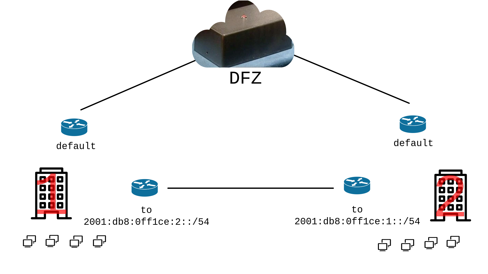
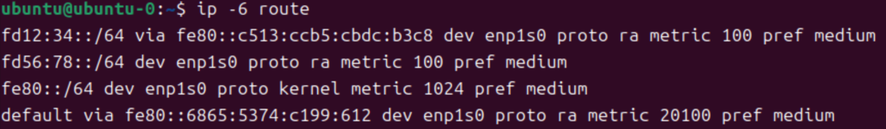
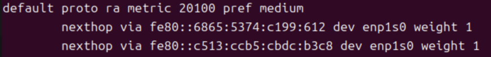

# 무중단 네트워크 서비스의 첫걸음: RFC 4191
[RFC 4191](https://datatracker.ietf.org/doc/html/rfc4191)에 라우터 정보
옵션(RIO)이 추가됨. 이는 [RFC
3442](https://serverfault.com/questions/640565/how-can-i-configure-my-dhcp-server-to-distribute-ip-routes)와
같이 LAN 내의 노드에 라우트를 전달하는 방법을 제공함. 단순한 DHCPv4와 달리, RA는
트래픽을 실제로 라우팅하는 라우터에서 돌아감. 이는 여러 가지 옵션을 탐색할 수
있는 가능성을 제공한다:

1. BGP의 ECMP 및 MED와 비슷한 방식의 부하 분산
1. 다중 프리픽스 경로: 다중 transparent VPN 게이트웨이, 사설망
1. fault tolerance: 네트워크의 단일 장애점(single point of failure)를 제거하기
   위해 옵션의 lifetime 속성 사용 가능

## 운영체제 지원
RFC 4191을 지원하는 운영체제는 RA 메시지에서 RIO를 받아 라우팅 테이블에 해당
프리픽스를 추가한다.

| OS | Support | Since | Note |
| - | - | - | - |
| 윈도 | YES | ? | [Windows Server 2012 문서](https://learn.microsoft.com/en-us/previous-versions/windows/it-pro/windows-server-2012-r2-and-2012/jj574227(v=ws.11))에 처음 언급됨 |
| 리눅스 | (아래 참조) | | |
| 안드로이드 | YES | [4.2](https://en.wikipedia.org/wiki/Comparison_of_IPv6_support_in_operating_systems) ? | 리눅스 지원은 안드로이드가 출시되기 전부터 있었음. 4.2버전부터 지원 되었을 것으로 봄 |
| XNU(IOS, macos) | YES | [xnu-7195.50.7.100.1](https://github.com/apple-oss-distributions/xnu/blame/8d741a5de7ff4191bf97d57b9f54c2f6d4a15585/bsd/netinet6/nd6_rtr.c#L490) | https://theapplewiki.com/wiki/Kernel#Versions |
| FreeBSD | [NO](https://github.com/freebsd/freebsd-src/blob/47ca5d103f229b090899379ce449af5e89faf627/sys/netinet6/nd6.c#L507) | - | 라우터 탐색 프로세스가 "rtsold" 유저스페이스 프로그램에 구현됨 |
| OpenBSD | [NO](https://github.com/openbsd/src/blob/36a0e83f909d48cbb69156be916b6356c14b9ae5/sbin/slaacd/engine.c#L1555) | - | 라우터 탐색 프로세스가 "slaacd" 유저스페이스 프로그램에 구현됨 |

### 리눅스
리눅스는 크게 3개의 RA 구현제가 존재한다:

 1. 커널 자체 (`CONFIG_IPV6_ROUTE_INFO`)
 2. NetworkManager
 3. Systemd-networkd

커널의 RIO
지원([v2.6.17-rc1](https://github.com/torvalds/linux/blame/4236f913808cebef1b9e078726a4e5d56064f7ad/net/ipv6/ndisc.c#L258)
버전부터 지원)은 선택사항이며, 기본적으로 활성화 되어있지 않으나, 대부분의
배포판이 기능을 활성화하여 빌드함.

RDNSS와 NTP 옵션은 유저공간 프로그램에서 처리되어야 해서 커널의 RA 구현은
임베디드 시스템이 아닌 이상 잘 사용되지 않음. 대부분의 시스템에는 공통적으로
`accept_ra = 0`로 설정되어 있다. NetworkManager와 Systemd-networkd는 RIO를
기본적으로 지원한다.

## 실전 RFC 4191


사무실 건물 1과 2 사이에 사설 L2 망이 있다 치자. 당연히 각 건물에는 인터넷을
위한 default 라우터가 있음. 두 건물에 존재하는 노드 수가 2048개(이더넷 스위치의
한계)도 되지 않는다면, 두 건물을 같은 L2 세그먼트로 운영할 수 있으므로 사설망을
위해 라우터는 불필요하다. 하지만 노드 수가 2048개 이상이면?

그럴 경우 네트워크를 분리해야 함. 네트워크를 분리하려면 라우터가 필요함. 일을 더
키우는 격으로 보이지만, 나중을 위해 충분히 가치 있는 일임.

사설망 라우터의 `radvd.conf` 파일은 다음과 같이 설정 가능.

```conf
# 1번 건물 네트워크 인터페이스
interface eth0 {
	AdvSendAdvert On;
	# 전 노드에 이 라우터를 게이트웨이로 쓰지 말라고 알림
	AdvDefaultLifetime 0;
	MinRtrAdvInterval 30;
	MaxRtrAdvInterval 120;

	route 2001:db8:0ff1ce:2::/54 {
		# 1분 안에 새로운 RA 메시지가 수신되지 않으면
		# 노드는 이 프리픽스를 테이블에서 제거함(expire)
		AdvRouteLifetime 60;
	};
};

# 사설망 인터페이스
interface eth1 {
	AdvSendAdvert On;
	# 상대 라우터에게 이 라우터를 게이트웨이로 쓰지 말라고 알림
	AdvDefaultLifetime 0;
	MinRtrAdvInterval 30;
	MaxRtrAdvInterval 120;

	route 2001:db8:0ff1ce:1::/54 {
		# 상대 라우터가 1분 이내에 새로운 RA 메시지를 받지 못하면,
		# 상대 라우터는 트래픽을 게이트웨이 라우터로 돌리기 시작함 (redirect)
		AdvRouteLifetime 60;
	};
};
```

라우터가 전송하는 RA 메시지는 첫번째 이미지와 같이 보일 것임. 게이트웨이
라우터와 사설망 라우터가 동시에 RA 메시지를 송출하는 경우에는, 각 노드에는
두번째 이미지와 같이 라우팅 테이블이 형성될 것임.




### 건물 사이 사설망 장애


사설망 중간에 중계기가 브리지가 없어서 라우터에 바로 링크 다운 상황(NO
CARRIER)이 감지되면, 두 라우터는 즉시 트래픽을 게이트웨이로 우회하기
시작함([ICMPv6
redirect](https://datatracker.ietf.org/doc/html/rfc4861#section-4.5)).

어찌되었건 두 라우터가 RA 메시지나 ND를 할 수 없는 상황이면 라우터는 각자
프리픽스를 1분 뒤 만료시켜 삭제할 것임. 삭제되면 트래픽은 게이트웨이로 우회되기
시작함.

네트워크 사용자(그리고 네트워크 관리자 마저도)는 별다른 이상징후를 포착하기 힘들
것임. 하지만 ICMP redirect 프로세스가 효율적이지 않음. 그리고 내부 트래픽이
인터넷을 타기 시작하면서 인터넷 망에 부하가 걸리기 시작하고, 내부 정보가
유출되는 상황이 연출될 수 있음. 업무에 사용하는 애플리케이션은 내부 트래픽을
특수하게 처리하지 않으면 그리 문제가 없지만, 만일의 정보 유출을 대비해서
게이트웨이 라우터에도 내부 프리픽스 트래픽을 VPN으로 암호화하는 것을 추천함.

### 사설망 라우터 장애
최대 1분 동안 두 건물이 서로 통신을 하지 못할 것임. 1분이 지나 라우팅 정보가
만료되면 노드들이 내부 트래픽을 게이트웨이로 전송하기 시작할 것임.

다른 라우터가 멀쩡한 건물의 사용자도 똑같이 1분 동안 장애를 겪을 것임. 그러나,
라우터의 프리픽스 정보가 만료되고 나면 라우터는 게이트웨이로 트래픽을 우회하기
시작할 것임. 이는 효율적이지 않음. 이를 막기 위해서 라우터를 수리하기 전까지는
사설망을 바로 건물 L2에다 연결하거나(bypass) 사설 라우터를 내려서 내부 트래픽도
인터넷을 타도록 할 수 있음.

### 인터넷 장애
... 뭐, 인터넷이 일단 안되겠지만, 사무실 사람들은 서로 각자 다른 건물에 있는
자원을 계속 사용할 수 있음!

### 전부 다 이중화!
사설망 라우터를 여러개 둘 수 있음. 각자 RA 메시지를 송출할 수 있고, 그렇게 되면
노드에 라우팅 테이블이 다음과 같이 형성됨. 이건 사설망 라우터 뿐만 아니라
게이트웨이에도 적용할 수 있음.



테이블에 목적지가 여러개 잡혀 있으면 노드는 그 중 하나를 택해서, 하나만 쓰도록
되어있음. 어떤 것이 선택되는 지는 거의 랜덤이므로 어느 정도의 로드벨런싱이
가능함.

이 구성은 크게 늘릴 수 있음. 그러다보면 IBGP를 사용해야 하는 지경까지 가고,
완벽한 무정전 서비스를 하려면 업무에 쓰는 모든 서비스를 직접 현장에서 호스팅해야
하긴 함. 거기까지는 무리일 듯.
